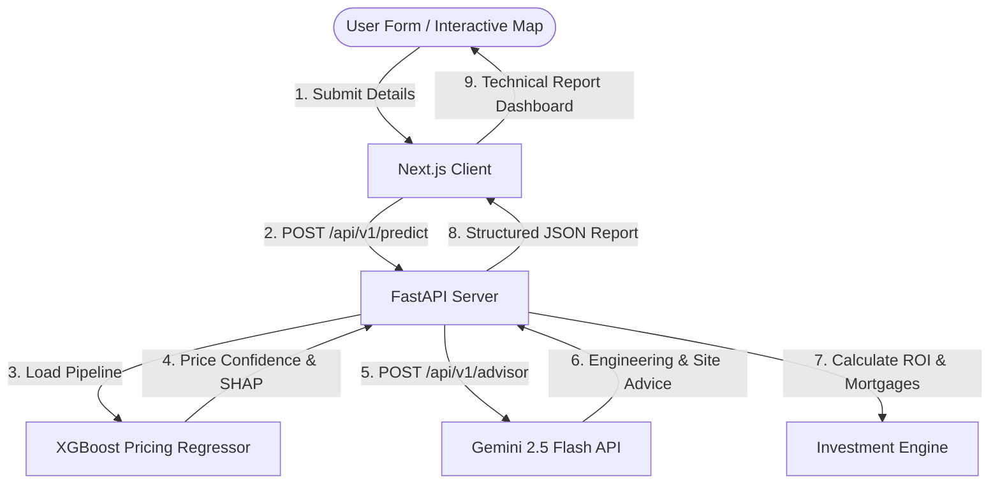

# ProphetIQ 🇵🇭
> The Next Generation of Real Estate, Construction, and Site Intelligence for Pangasinan.

ProphetIQ is a sophisticated, data-driven real estate valuation and buildability intelligence platform designed for Pangasinan, Philippines. By combining coordinate-aware XGBoost machine learning regressors with localized spatial data and Gemini-powered LLM engineering advisors, ProphetIQ bridges the gap between property market value and project feasibility. The platform empowers developers, buyers, and builders to evaluate land value, calculate build costs, analyze local site suitability (such as flooding risk), and run full investment analysis inside a single unified cockpit.

---

## 🛠️ Tech Stack

* **Frontend**: Next.js 14, React, TailwindCSS, Leaflet (Interactive maps), Sonner, Lucide React
* **Backend**: FastAPI (Python 3.10+), Pydantic v2, Uvicorn
* **Machine Learning**: XGBoost, Scikit-Learn, SHAP (SHapley Additive exPlanations), Joblib
* **AI Engine**: Google Gemini AI (gemini-2.5-flash)

---

## 🏗️ Technical Architecture



---

## 📁 Repository Structure

```markdown
ProphetIQ/
├── backend/
│   ├── data/                 # Raw and clean Philippine property datasets
│   ├── ml/                   # Model training scripts, estimators (.pkl) and SHAP explainers
│   ├── routers/              # Endpoint routers (prediction, advisor, investment)
│   ├── schemas/              # Pydantic validation schemas
│   ├── services/             # Core ML predictor and pricing services
│   └── main.py               # Main FastAPI entry point
└── frontend/
    ├── src/
    │   ├── app/              # Next.js page routers & global styling
    │   ├── components/       # Premium React dashboards, estimators, & map mockups
    │   ├── lib/              # API wrapper services
    └── tailwind.config.ts    # Custom Tailwind variables and theme system
```

---

## ⚙️ Environment Variables

### Backend Configuration (`backend/.env`)
| Variable | Description | Example |
| :--- | :--- | :--- |
| `GEMINI_API_KEY` | Google AI Studio Key for site assessment advisor | `AIzaSy...` |
| `ADMIN_SECRET` | Secret key for protecting admin diagnostics endpoints | `your-secure-admin-pass` |

### Frontend Configuration (`frontend/.env.local`)
| Variable | Description | Example |
| :--- | :--- | :--- |
| `NEXT_PUBLIC_API_URL` | Endpoint of the FastAPI backend | `http://localhost:8000/api/v1` |

---

## 🚀 Local Setup Instructions

### 1. Clone and Navigate to the Repository
```bash
git clone https://github.com/Unlighted01/ProphetIQ-.git
cd ProphetIQ-
```

### 2. Backend Setup (FastAPI)
1. **Create and Activate a Virtual Environment:**
   ```bash
   # Windows PowerShell
   python -m venv venv
   .\venv\Scripts\Activate.ps1
   ```
2. **Install Dependencies:**
   ```bash
   pip install -r backend/requirements.txt
   ```
3. **Configure Environment:**
   Create a `backend/.env` file and populate:
   ```env
   GEMINI_API_KEY=your_gemini_api_key_here
   ADMIN_SECRET=your_admin_secret_here
   ```
4. **Start the FastAPI Dev Server:**
   ```bash
   python backend/main.py
   ```
   *The backend will now be live on [http://localhost:8000](http://localhost:8000) with interactive Swagger documentation at [http://localhost:8000/docs](http://localhost:8000/docs).*

### 3. Frontend Setup (Next.js)
1. **Navigate to the frontend folder:**
   ```bash
   cd frontend
   ```
2. **Install Node modules:**
   ```bash
   npm install
   ```
3. **Configure Local Environment:**
   Create a `frontend/.env.local` file:
   ```env
   NEXT_PUBLIC_API_URL=http://localhost:8000/api/v1
   ```
4. **Start Dev Server:**
   ```bash
   npm run dev
   ```
   *The frontend dashboard will now be live on [http://localhost:3000](http://localhost:3000).*

---

## 🖼️ Application Showcases
*(Placeholders for future production showcases)*

* **Dynamic Heatmap Site Selector**
* **XGBoost Feature SHAP Analysis**
* **Geotechnical AI Advisor Dashboard**
* **Unified Construction Cost Calculator & Investment Cockpit**

---

## 🔗 Production Links

* **Live Frontend:** *[ProphetIQ Production App](https://prophetiq-production-link.vercel.app)*
* **API Documentation:** *[ProphetIQ API Health](https://prophetiq-backend-railway.up.railway.app/docs)*
